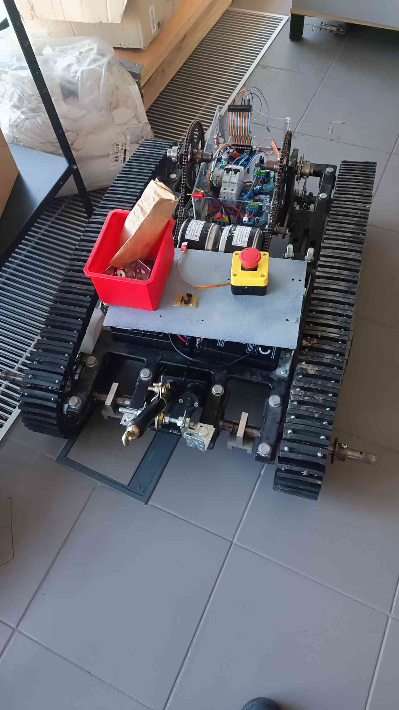
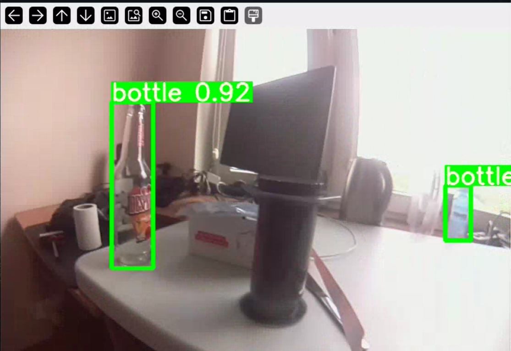

# Robot Centurio

### Screenshots

## Description
Centurio is a tracked robot designed for autonomous operation. Initially controlled by Arduino, it later switches to Raspberry Pi for autonomous driving. The robot is equipped with two motors, a camera, and uses the YOLO model for object detection to identify bottles. The robot can be manually controlled via Wi-Fi from a computer and also operate autonomously, driving towards a detected bottle and stopping in front of it.

The project includes the full build of the robot, its electronics, and programming for both manual and autonomous operation.

## Features
- **Tracked Robot**: The robot is based on a tracked chassis for stability and mobility.
- **Manual Control**: Can be controlled via Wi-Fi from a computer.
- **Autonomous Driving**: The robot uses the YOLO model for detecting bottles and can autonomously navigate towards them, stopping in front of each bottle.
- **Camera Feed**: Streams video from the robot's camera to the computer for real-time observation.
- **Electronics**: The project involves both Arduino and Raspberry Pi for control and processing tasks.

## Technologies Used
- **Arduino**: Initial controller for motor control and basic operations.
- **Raspberry Pi**: Used for autonomous driving and camera streaming.
- **YOLO**: Object detection model for identifying bottles.
- **Python**: For programming the Raspberry Pi and controlling the robot.

